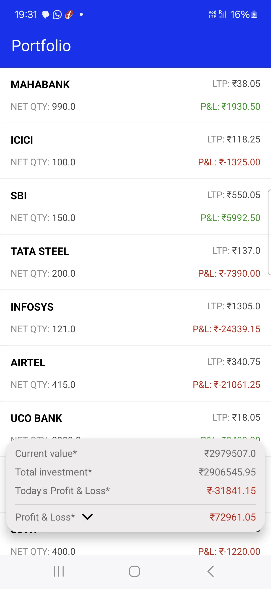

# Project - Vipul Goyal Task

## Description

1. This project displays the portfolio list online and offline
2. Architecture used: MVVM with clean

## Tech Stack

- **Kotlin:** Primary programming language.
- **Jetpack Libraries:**
   - **ViewModel**: For MVVM architecture.
   - **Flow**: For reactive data streams.
   - **Room**: For local database/offline storage.
   - **Retrofit**: For network requests.
- **Coroutines:** For asynchronous programming.
- **Dagger/Hilt:** For DI

## Screenshots
Demonstration of the app is attached in the folder named screenshots. You can find them in the [screenshots](screenshots) directory.

Screen shots:

